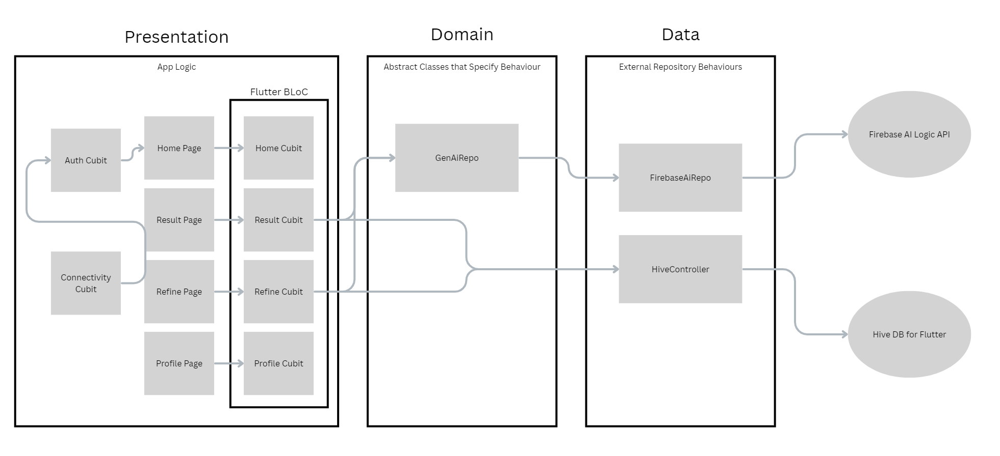

# Itinera AI - Smart Trip Planner

AI-Powered smart trip itinerary generator made using flutter.

## Features

- Give a prompt to generate a trip itinerary.
- Chat with the AI to refine the trip itinerary
- Save trip plans to view later (Without internet connection!)

## Setup and Installation
### Configuration
1. Ensure Flutter SDK is installed
2. Clone the repository
2. Configure Firebase
   - install firebase using
        ```
        npm install -g firebase-tools
        ```
    - login using
        ```
        firebase login
        ```
    - install flutterfire cli using
        ```
        dart pub global activate flutterfire_cli
        ```
4. Clone the repository
5. Generate files for Hive db
   ```
   flutter pub run build_runner build --delete-conflicting-outputs
   ```
6. Run the app using
    ```
   flutter run
    ```

##  Architecture

The app follows a feature-first, layered architecture using **Flutter Bloc** for state management. This promotes separation of business logic and frontend.



Some points to note
- Hive controller does not have a domain class as it is a static singleton class now. Domain implementation will be done in the future

## How the AI Agent Works

The core of the app is powered by Firebase AI Logic SDK for Flutter, which allows us to access Gemini-2.5-flash LLM, which we then use to redirect the user prompt and get the result in the form of a readable JSON.

1. The Prompt is provided in such a way the result is always a JSON schema, along with proper error handling

2. The model is given access to Google search via the inbuilt GoogleSearch tool, which allows the model to get real-time data from google to provide the best itinerary.

3.  **JSON Output & Validation**: The prompt asks the model to respond in a structured JSON format, including a `status` field (`"success"` or `"failure"`).
    - The app code parses the model's text response to extract the JSON block.
    - It then decodes the JSON and checks the `status` field. If the status is `"failure"` or if the JSON is malformed, the app handles it as an error, providing clear feedback to the user. This acts as a layer of self-validation.

## Token Cost Analysis

The following table shows the average token usage for typical interactions with the `gemini-1.5-flash` model during testing. This data is used to provide users with an estimate of their API consumption.

| Action             | Prompt Tokens (Input) | Completion Tokens (Output) | Notes                                                                                                    |
| :----------------- | :-------------------- | :------------------------- | :------------------------------------------------------------------------------------------------------- |
| **Initial Search** | ~250                  | ~800                       | Generating a 3-day itinerary for a city.                                                                 |
| **Refine Request** | ~400                  | ~1000                      | Refining the previous itinerary (e.g., "add more restaurants"). The prompt includes the previous output. |
| **Invalid Prompt** | ~430                  | ~20                        | Responding to an irrelevant prompt (e.g., "what is the capital of France?").                             |

## Improvements to be made
- Result from prompt is displayed as a single text block. Future goals include modularizing the output to include Google maps link to each item in a day, along with image generations, and ability to select block of text from the result for refining prompt.

- 
